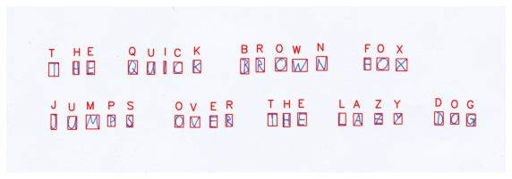

# Character detection / OCR with EMNIST

A simple OCR project using the EMNIST ([Cohen et al., 2017](https://arxiv.org/pdf/1702.05373)) dataset.

## Howto
Run the notebook `demo.ipynb` to train the classifier and show the demo.

## Details

The pipeline works as follows:
1. The raw image is denoised and binarized.
2. Single contours are detected with OpenCV and the corresponding regions of interest (ROI) are extracted and converted into 28x28 grayscale images.
3. The ROIs are fed into a CNN that has been trained on a subset of the EMNIST dataset.

The classifier is a convolutional neural network and a variation of the LeNet ([LeCun et al.,1998](http://vision.stanford.edu/cs598_spring07/papers/Lecun98.pdf)) architecture.
For now, it is trained on the upper case letters A-Z of the "By_Class" split of the EMNIST dataset.
